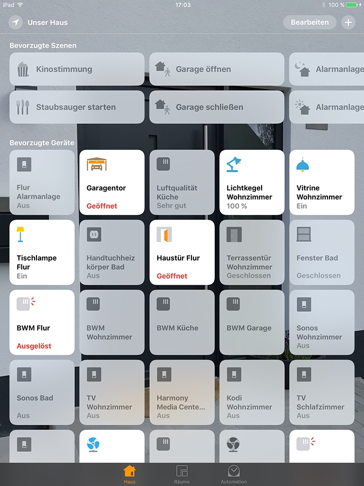

# homebridge-devolo

## Homebridge plugin for Devolo Home Control
(C) 2017, Kevin Dietrich

This homebridge plugin allows you to control your Devolo Home Control devices via Apple's homekit. The following devices are currently supported:

- Smart Metering Plug (v1/v2)
- Motion Sensor
- Humidity Sensor
- Motion Sensor
- Door Sensor / Window Contact
- Thermostat Valve
- Smoke Detector
- Room Thermostat
- Wall Switch
- Remote Control
- Qubino Flush Shutter



Feel free to submit an issue or pull request to add more.

## How-to

1. Install homebridge: `npm install -g homebridge`
2. Install homebridge-devolo plugin: `npm install -g homebridge-devolo`
3. Modify your `config.json`. Host is the IP address of your Devolo Home Control central unit. Email and password are your mydevolo.com credentials.

```
"platforms": [
  {
    "platform" : "Devolo",
    "name" : "Devolo",
    "host" : "x.x.x.x",
    "email" : "mail@host.com",
    "password" : "topsecret123"
  }
]
```

## Optional parameters

| Name of parameter | Default value | Notes |
|---|---|---|
| `ruleWhitelist`  | `['MyRule1', 'MyRule2']` | specify the rules which you want to use in Apple Home by their exact names. By default no rule is exported. |
| `sceneWhitelist`  | `['MyScene1', 'MyScene2']` | specify the scenes which you want to use in Apple Home by their exact names. By default no scene is exported. |
| `deviceBlacklist`  | `['BlockedDevice1', 'BlockedDevice2']` | specify the devices which you DON'T want to use in Apple Home by their exact names. By default all devices are exported. |
| `deviceDebugging`  | `false` | when set to true homebridge-devolo will output some debugging information and terminate afterwards. This is helpful to get information for new device integrations. |

## Credits

Powered by [node-devolo](https://github.com/kdietrich/node-devolo).
Thanks to [@nicoh88](https://github.com/nicoh88).

## Support of new devices

I'm happy to provide support for new devices. If you own an unsupported device you can provide me a debug log making the device integration easier for me. In order to do so set the config parameter `deviceDebugging` to `true` and run the following command: `homebridge -D | tee debugoutput.log`. The command will auto-finish after a while and create a textfile named `debugoutput.log`. Please attach this log file to your github issue.

## Troubleshooting

If you run into issues related to this plugin, feel free to open an issue. Please start your homebridge installation with the command `homebridge -D > logfile.txt 2>&1` and attach the generated logfile.

## Changes

#### v0.1.7-dev
- Remote control supported
- Device debugging for faster support of new devices

#### v0.1.6 (2018-01-18)
- Wall Switch supported
- Filter devices with deviceBlacklist
- Bugfix: Increased max listeners

#### v0.1.5 (2017-09-29)
- Qubino Flush Shutter supported
- Sockets instead of slow polling
- Various bugfixes
- Performance improvements

#### v0.1.4 (2017-07-15)
- Smoke Detector supported
- Thermostat Valve supported
- Room Thermostat supported
- Smart Metering Plug v2 supported
- Support of Rules and Scenes via whitelist
- Performance optimizations
- Bugfix: Restart heartbeat in case of an error
- Bugfix: Renew session if it has gone invalid

#### v0.1.3 (2017-03-06)
- Switch Meter Device does not switch if disabled in devolo webgui.
- Switch Meter Device shows current consumption and total consumption.
- Door Sensor / Window Contact and Motion Device show light level.
- Heartrate interval can be specified in config.
- Bugfix: Fast switching of Switch Meter Device.

#### v0.1.2 (2017-02-22)
- Bugfix: Switching of Switch Meter Device.

#### v0.1.1 (2017-02-21)
- First version.

## License

The MIT License (MIT)

Copyright (c) 2017 Kevin Dietrich

Permission is hereby granted, free of charge, to any person obtaining a copy
of this software and associated documentation files (the "Software"), to deal
in the Software without restriction, including without limitation the rights
to use, copy, modify, merge, publish, distribute, sublicense, and/or sell
copies of the Software, and to permit persons to whom the Software is
furnished to do so, subject to the following conditions:

The above copyright notice and this permission notice shall be included in all
copies or substantial portions of the Software.

THE SOFTWARE IS PROVIDED "AS IS", WITHOUT WARRANTY OF ANY KIND, EXPRESS OR
IMPLIED, INCLUDING BUT NOT LIMITED TO THE WARRANTIES OF MERCHANTABILITY,
FITNESS FOR A PARTICULAR PURPOSE AND NONINFRINGEMENT. IN NO EVENT SHALL THE
AUTHORS OR COPYRIGHT HOLDERS BE LIABLE FOR ANY CLAIM, DAMAGES OR OTHER
LIABILITY, WHETHER IN AN ACTION OF CONTRACT, TORT OR OTHERWISE, ARISING FROM,
OUT OF OR IN CONNECTION WITH THE SOFTWARE OR THE USE OR OTHER DEALINGS IN THE
SOFTWARE.